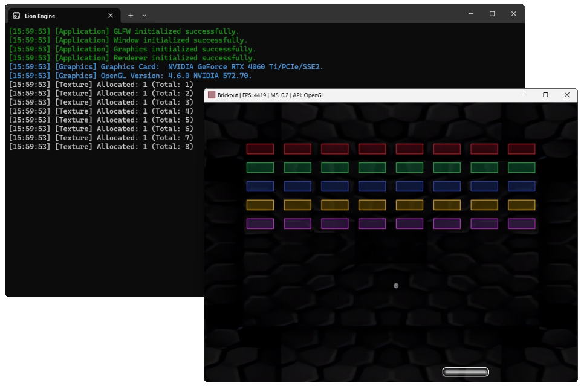

<body>

  <h1>🦁 Lion Engine</h1>
  

    Lion Engine is a <strong>2D game engine</strong> written in <strong>C++</strong>, built primarily for my personal use and continuous improvement as a software engineer.
    It combines architectural concepts and ideas inspired by <strong>Judson Santiago’s Volt Engine</strong>, <strong>Yan Chernikov’s Hazel Engine</strong>, and my own preferences — resulting in a lightweight, modular, and educational codebase.
  

  

  

    <h2>📑 Table of Contents</h2>
    <ul>
      <li><a href="#preview">🚀 Preview</a></li>
      <li><a href="#structure">📂 Project Structure</a></li>
      <li><a href="#dependencies">🛠 Dependencies</a></li>
      <li><a href="#build-run">🏗 Build &amp; Run</a></li>
      <li><a href="#credits">🙏 Credits</a></li>
      <li><a href="#license">📜 License</a></li>
    </ul>
  

  

    <h2>🚀 Preview</h2>
    
Coming soon — screenshots, demos, and GIFs will be added here.

    
  

  

    <h2>📂 Project Structure</h2>
    
The project is organized for clarity and extensibility. Below is an overview of its main directories:

<pre><code>Lion Engine
│
├── Engine
│   ├── Include
│   │   └── Lion
│   │       ├── Launcher.h
│   │       └── Lion.h
│   │
│   └── Source
│       └── Lion
│           ├── Base
│           │   ├── External.h
│           │   ├── Platform.h
│           │   └── Standard.h
│           │
│           ├── Core
│           │   ├── Application.cpp / .h
│           │   ├── Asset.cpp / .h
│           │   ├── Clock.cpp / .h
│           │   ├── Input.cpp / .h
│           │   ├── Layer.cpp / .h
│           │   ├── Log.cpp / .h
│           │   ├── Stack.cpp / .h
│           │   └── Window.cpp / .h
│           │
│           ├── Logic
│           │   ├── Actor.cpp / .h
│           │   ├── Entity.cpp / .h
│           │   ├── Scene.cpp / .h
│           │   └── Timer.cpp / .h
│           │
│           ├── Math
│           │   ├── Sigma.cpp / .h
│           │   ├── Transform.cpp / .h
│           │   └── Vector.cpp / .h
│           │
│           ├── Render
│           │   ├── Camera.cpp / .h
│           │   ├── CameraOrthographic.cpp / .h
│           │   ├── Graphics.cpp / .h
│           │   ├── RenderCommand.cpp / .h
│           │   ├── Renderer.cpp / .h
│           │   ├── Sprite.cpp / .h
│           │   └── Texture.cpp / .h
│           │
│           ├── Signal
│           │   ├── Event.cpp / .h
│           │   ├── EventDispatcher.cpp / .h
│           │   ├── EventInput.cpp / .h
│           │   └── EventWindow.cpp / .h
│           │
│           ├── Type
│           │   ├── Allocator.cpp / .h
│           │   ├── Depth.cpp / .h
│           │   ├── Macro.cpp / .h
│           │   ├── Primitive.cpp / .h
│           │   └── Size.cpp / .h
│           │
│           ├── Engine.cpp / .h
│           ├── cpp.hint
│           └── premake5.lua
│
├── Game
│   ├── Resource
│   │   └── ...
│   │
│   └── Source
│       ├── Actor
│       │   ├── Ball.cpp / .h
│       │   ├── Brick.cpp / .h
│       │   ├── Manager.cpp / .h
│       │   └── Paddle.cpp / .h
│       │
│       ├── Layer
│       │   ├── CoreLayer.cpp / .h
│       │   ├── GameLayer.cpp / .h
│       │   └── Sandbox.cpp / .h
│       │
│       └── premake5.lua
│
├── Scripts
│   └── Generate.bat
│
├── Vendor
│   └── ...
│
├── .gitignore
├── .gitmodules
├── LICENCE
├── README.md
└── premake5.lua
</code></pre>
  

  

    <h2>🛠 Dependencies</h2>
    
Lion Engine relies on the following libraries (included as submodules under <code>Vendor/</code>):

    <ul>
      <li><a href="https://github.com/erincatto/box2d">Box2D</a> – 2D physics</li>
      <li><a href="https://github.com/Dav1dde/glad">GLAD</a> – OpenGL loader</li>
      <li><a href="https://github.com/glfw/glfw">GLFW</a> – Window & input management</li>
      <li><a href="https://github.com/g-truc/glm">GLM</a> – Math library for graphics</li>
      <li><a href="https://github.com/ocornut/imgui">ImGui</a> – Immediate mode GUI</li>
      <li><a href="https://github.com/gabime/spdlog">spdlog</a> – Fast logging</li>
      <li><a href="https://github.com/nothings/stb">stb</a> – Image loading utilities</li>
    </ul>
  

  

    <h2>🏗 Build &amp; Run</h2>
    
Want to build and run Lion Engine? Just follow these steps:

    <ol>
      <li>
        <strong>Install <a href="https://premake.github.io">Premake5</a>:</strong>  
        Ensure <code>premake5</code> is installed and available in your system’s PATH.
      </li>
      <li>
        <strong>Clone the repository with submodules:</strong>  
<pre><code>git clone --recursive https://github.com/TheSampaio/Lion</code></pre>
        If you cloned without submodules, initialize them with:  
<pre><code>git submodule update --init</code></pre>
      </li>
      <li>
        <strong>Generate project files:</strong>  
        From the root folder, run the appropriate <a href="https://premake.github.io/docs/Using-Premake">Premake command</a> for your IDE. Example for Visual Studio 2022:  
<pre><code>premake5 vs2022</code></pre>
      </li>
      <li>
        <strong>Open and build the project:</strong>  
        Open the generated solution in your IDE of choice, build it, and you’re good to go!
      </li>
    </ol>
  

  

    <h2>🙏 Credits</h2>
    
A huge thank you to creators whose free content inspired this project:

    <ul class="credits">
      <li>
        <strong>Judson Santiago</strong> 
        GitHub: <a href="https://github.com/JudsonSS">JudsonSS</a> 
        YouTube: <a href="https://www.youtube.com/@JudSan/featured">@JudSan</a> 
        Project: <a href="https://github.com/JudsonSS/Volt-Engine">Volt Engine</a>
      </li>
       
      <li>
        <strong>Yan Chernikov (The Cherno)</strong> 
        GitHub: <a href="https://github.com/TheCherno">TheCherno</a> 
        YouTube: <a href="https://www.youtube.com/@TheCherno">@TheCherno</a> 
        Project: <a href="https://github.com/TheCherno/Hazel">Hazel Engine</a>
      </li>
    </ul>
    
If you’re interested in learning about <strong>game engine development</strong> and <strong>computer graphics</strong>, their content is an invaluable resource.

  

  

    <h2>📜 License</h2>
    

      This project is licensed under the <strong>Apache License 2.0</strong>.
      You’re free to use, modify, and distribute this engine, but you must credit the original author and include a copy of the license.
      For details, see the <a href="https://www.apache.org/licenses/LICENSE-2.0">Apache License 2.0</a>.
    

  

</body>
