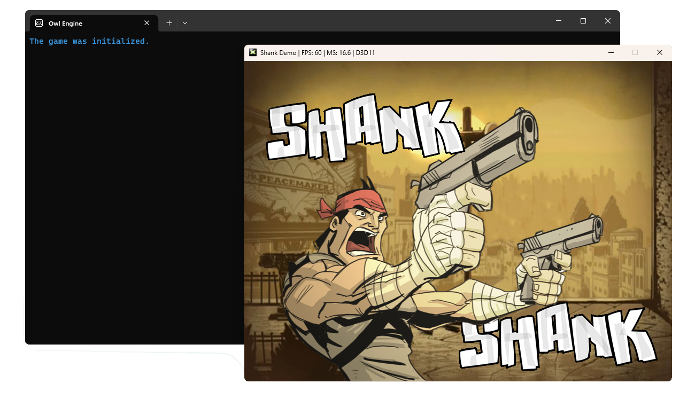

<h1>Owl Engine</h1>
<section>
    This is a 2D game engine made in C++ that uses D3D11 to draw on screen. The project is still in progress and because of this does not represent the final result and may contain some bugs depending on your OS's version or hardware. I plan to add support for D3D12 in the future, but only after all the basic features are ready.
</section> 

<h2>Credits</h2>
<section>
    The game engine is being developed following the classes of <a href="https://github.com/JudsonSS">Judson Santiago</a> (Master in Computer Science from the Federal Rural University of the Semiarid (UFERSA)) on <a href="https://www.youtube.com/@JudSan">YouTube</a>. The entire architecture of the game engine was planned by him, because of that all the credits are his. The <a href="https://github.com/JudsonSS/Jogos">original project</a> also was developed using D3D11 as the graphics API, so you can follow the it to know more about the game engine's architecture.
</section> 
<h2>Honorable Mentions</h2>
<sectionr>
    I would also like to thank <a href="https://www.youtube.com/@TheCherno">The Cherno</a> for his playlist on YoTube, <a href="https://www.youtube.com/watch?v=JxIZbV_XjAs&list=PLlrATfBNZ98dC-V-N3m0Go4deliWHPFwT"><i>Game Engine</i></a> and for his biggest project on GitHub, <a href="https://github.com/TheCherno/Hazel"><i>Hazel</i></a>.
</section>