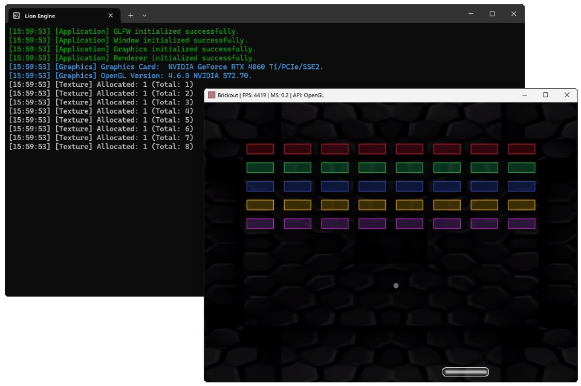

<body>
  <h1>🦁 Lion Engine</h1>
  

    Lion Engine is a <strong>2D game engine</strong> written in <strong>C++</strong>, built primarily for my personal use and continuous improvement as a software engineer.
    It combines architectural concepts and ideas inspired by <strong>Judson Santiago’s Volt Engine</strong>, <strong>Yan Chernikov’s Hazel Engine</strong>, and my own preferences — resulting in a lightweight, modular, and educational codebase.
  

  
  

    <h2>📑 Table of Contents</h2>
    <ul>
      <li><a href="#preview">🚀 Preview</a></li>
      <li><a href="#features">✨ Features</a></li>
      <li><a href="#structure">📂 Project Structure</a></li>
      <li><a href="#dependencies">🛠 Dependencies</a></li>
      <li><a href="#build-run">🏗 Build &amp; Run</a></li>
      <li><a href="#how-it-was-built">🧭 How It Was Built</a></li>
      <li><a href="#credits">🙏 Credits</a></li>
      <li><a href="#license">📜 License</a></li>
    </ul>
  

  

    <h2>🚀 Preview</h2>
    
Coming soon — screenshots, demos, and GIFs will be added here.

    
    
The bundled <strong>Brickout</strong> sandbox is a playable, physics-driven demo. Move the paddle with <kbd>A</kbd> / <kbd>D</kbd>; the ball bounces off the walls and destroys bricks on contact.

  

  

    <h2>✨ Features</h2>
    <h3>Engine</h3>
    <ul>
      <li><strong>Entities &amp; Components</strong> — an <code>Entity</code> is <em>composed</em>, never derived: it is a name, a <code>Transform</code> and the components attached to it. Everything else is a component, including collision (<code>Component::OnCollision</code>), because a trait added by subclassing is one the editor cannot list, the scene cannot save and another entity cannot reuse.</li>
      <li><strong>Reflection</strong> — a component describes its fields once, in <code>Reflect()</code>, and the engine reads that twice: the scene file saves from it and the Inspector draws from it. Serialization goes through an abstract <code>Serializer</code>, so no third-party type ever crosses into a component’s translation unit.</li>
      <li><strong>The game is a module</strong> — game code compiles to its own DLL, and components register themselves by name (<code>LION_REGISTER_COMPONENT</code>). That is what lets the editor list, create and serialize a type it was never compiled against.</li>
      <li><strong>2D Physics</strong> — <a href="https://github.com/erincatto/box2d">Box2D</a> behind a <code>PhysicsWorld</code> with a fixed time step, transform synchronization and contact events routed to the components that care.</li>
      <li><strong>Backend-agnostic renderer</strong> — every OpenGL call lives behind a small RHI (<code>RendererAPI</code>, <code>GraphicsContext</code>, <code>Shader</code>, <code>Buffer</code>, <code>VertexArray</code>, <code>Texture</code>), so a Vulkan backend can be added without touching high-level code.</li>
      <li><strong>Batched sprite rendering</strong> — sprites are batched into a single dynamic buffer with per-frame texture slotting and depth sorting, issued in one draw call.</li>
      <li><strong>Asset sealing</strong> — <code>Vault</code> is the one place the format lives (XOR, then URL-safe base64). A scene is sealed by the editor that saves it; a shipped game’s shaders are sealed by the build. Loading never has to know which kind it has — plain content comes back unchanged. It is obfuscation, not encryption.</li>
      <li><strong>Layer stack, events, input, logging and a resource cache</strong> for building games on top of the engine.</li>
    </ul>
    <h3>Editor (<em>Lion’s Mane</em>)</h3>
    <ul>
      <li><strong>Scene editing</strong> — a viewport with <a href="https://github.com/CedricGuillemet/ImGuizmo">ImGuizmo</a> tools, multi-selection, drag-and-drop parenting, undo/redo, and play / pause / step / stop against the live scene.</li>
      <li><strong>Inspector</strong> — every component drawn from its own reflection, with per-field revert, a uniform-scale padlock, and required components pulled in automatically (<code>LION_REQUIRES</code>).</li>
      <li><strong>Hot reload</strong> — scaffold a C++ component from the editor, compile it, and the module is swapped back in without restarting: the editor loads a private copy of the DLL so the original stays writable.</li>
      <li><strong>Content Browser, Console and Statistics</strong> — create, rename and delete project assets; a console that collapses repeats and renders through a clipper; frame, renderer and scene counters.</li>
      <li><strong>Its own window</strong> — a caption the editor draws itself, and <code>.lscene</code> files registered with Windows on first run, so Explorer shows them with the engine’s icon and a double-click opens them here.</li>
    </ul>
  

  

    <h2>📂 Project Structure</h2>
    
A folder is never named after its project, so a path always says which of the two it means.

    <table>
      <tr><th>Folder</th><th>Project</th><th>Output</th><th>What it is</th></tr>
      <tr><td><code>Engine/</code></td><td><code>Lion</code></td><td><code>lion-core.dll</code></td><td>The engine.</td></tr>
      <tr><td><code>Editor/</code></td><td><code>Mane</code></td><td><code>Lion.exe</code></td><td>The editor — the face of the engine, so it carries its name.</td></tr>
      <tr><td><code>Launcher/</code></td><td><code>Launcher</code></td><td><code>lion-launcher.exe</code></td><td>Thin executable: loads the game module and runs it.</td></tr>
      <tr><td><code>Sandbox/</code></td><td><code>Game</code></td><td><code>lion-game.dll</code></td><td>The game’s code, as a module. Brickout lives here.</td></tr>
    </table>
<pre><code>Lion Engine
│
├── Engine                  # The engine (lion-core.dll)
│   ├── Include/Lion        # Public umbrella headers: Lion.h, Launcher.h
│   └── Source/Lion
│       ├── Base            # Platform, standard and external includes
│       ├── Core            # Application, Window, Layer, Log, Clock, Input,
│       │                   #   Asset, Vault, GameModule, DynamicLibrary, Build
│       ├── Logic           # Entity, Component, Scene, Reflector, SceneSerializer
│       ├── Math            # Transform, Vector, Sigma
│       ├── Physics         # PhysicsWorld, RigidBody2D, BoxCollider2D, CircleCollider2D
│       ├── Platform        # GLFW window backend, file dialogs, file association
│       ├── Render          # RHI + OpenGL backend, batched Renderer, SpriteRenderer
│       ├── Signal          # Events and dispatching
│       └── Type            # Primitives, allocators, macros
│
├── Editor                  # The editor (Lion.exe)
│   └── Source
│       ├── Layer           # EditorLayer: viewport, panels, gizmos, hot reload
│       ├── EditorGui       # Dear ImGui lifecycle, theme and fonts
│       ├── ModuleSymbols   # Debug symbols for the module's private copy
│       └── Sealer          # "Lion.exe --seal": the build sealing a shipped game's assets
│
├── Launcher                # The standalone player (lion-launcher.exe)
│
├── Sandbox                 # The game module (lion-game.dll)
│   ├── Assets
│   │   ├── Scripts         # The game's components: Ball, Paddle, Brick, BrickField...
│   │   ├── Shaders
│   │   └── Sprites
│   └── GameModule.cpp      # The module's entry points
│
├── Scripts                 # Build.bat, Generate.bat
├── Vendor                  # Every dependency, as a submodule
│
├── .gitmodules
├── CLAUDE.md
├── LICENCE
├── README.md
└── premake5.lua
</code></pre>
  

  

    <h2>🛠 Dependencies</h2>
    
Every dependency is a <strong>Git submodule</strong> under <code>Vendor/</code> — nothing is copied into the tree by hand, so <code>git clone --recursive</code> is all a fresh machine needs. Each one is a fork carrying the <code>premake5.lua</code> that says how this workspace builds it.

    <ul>
      <li><a href="https://github.com/erincatto/box2d">Box2D</a> – 2D physics</li>
      <li><a href="https://github.com/Dav1dde/glad">GLAD</a> – OpenGL loader</li>
      <li><a href="https://github.com/glfw/glfw">GLFW</a> – Window &amp; input management</li>
      <li><a href="https://github.com/g-truc/glm">GLM</a> – Math library for graphics</li>
      <li><a href="https://github.com/ocornut/imgui">Dear ImGui</a> – Immediate mode GUI (editor only)</li>
      <li><a href="https://github.com/CedricGuillemet/ImGuizmo">ImGuizmo</a> – Viewport gizmos (editor only)</li>
      <li><a href="https://github.com/nlohmann/json">nlohmann/json</a> – Scene serialization</li>
      <li><a href="https://github.com/Templarian/MaterialDesign-Webfont">Material Design Icons</a> – The editor’s icon font, merged into its text atlas</li>
      <li><a href="https://github.com/juliettef/IconFontCppHeaders">IconFontCppHeaders</a> – Names for that font’s glyphs</li>
      <li><a href="https://github.com/gabime/spdlog">spdlog</a> – Fast logging</li>
      <li><a href="https://github.com/nothings/stb">stb</a> – Image loading utilities</li>
    </ul>
  

  

    <h2>🏗 Build &amp; Run</h2>
    <ol>
      <li>
        <strong>Install <a href="https://premake.github.io">Premake5</a>:</strong>
        ensure <code>premake5</code> is available in your <code>PATH</code>.
      </li>
      <li>
        <strong>Clone with submodules:</strong>
<pre><code>git clone --recursive https://github.com/TheSampaio/Lion</code></pre>
        If you already cloned without them: <code>git submodule update --init --recursive</code>
      </li>
      <li>
        <strong>Build:</strong> from the root folder, the script generates the projects and builds everything.
<pre><code>Scripts\Build.bat [Debug|Release|Shipping]</code></pre>
        Or by hand: <code>premake5 vs2022</code>, then open <code>Lion.sln</code> and build.
      </li>
      <li>
        <strong>Run:</strong> the editor from <code>Build/Bin/&lt;config&gt;/Mane/Lion.exe</code>, the game from <code>Build/Bin/&lt;config&gt;/Launcher/lion-launcher.exe</code>.
      </li>
    </ol>
    

      The editor greets with the <strong>Project Manager</strong>: pick a recent project, open a folder as one, or
      create a new one — the engine scaffolds it, builds its module and opens it. Two command-line arguments skip
      the greeting:
    

    <table>
      <tr><th>Argument</th><th>What it does</th></tr>
      <tr><td><code>Lion.exe &lt;path&gt;.lscene</code></td><td>Opens that scene directly (what double-clicking a scene in Explorer passes).</td></tr>
      <tr><td><code>Lion.exe --no-project-manager</code></td><td>Skips the Project Manager and opens the built-in project and demo scene — for iterating on the editor itself, where relaunching is constant.</td></tr>
    </table>
    
Three configurations, each there to catch something the others cannot:

    <table>
      <tr><th>Configuration</th><th>Optimised</th><th>Symbols</th><th>What it is for</th></tr>
      <tr><td><strong>Debug</strong></td><td>no</td><td>yes</td><td>Day-to-day work; the game logs everything.</td></tr>
      <tr><td><strong>Release</strong></td><td>yes</td><td>no</td><td>Measuring performance with the engine still talking.</td></tr>
      <tr><td><strong>Shipping</strong></td><td>yes</td><td>no</td><td>What reaches a player: no logs, sealed assets, its own entry point.</td></tr>
    </table>
    
Adding or removing a source file means regenerating — the project file lists are globs.

  

  

    <h2>🧭 How It Was Built</h2>
    

      The foundation of Lion Engine is hand-written: the application and layer stack, the window and event
      system, the math, the resource layer, and the renderer — from the RHI down to the batched 2D
      renderer — were built by me, line by line, before any AI was part of this project. That is where I
      learned what an engine actually <em>is</em>, and it is the part I would never have wanted to skip.
    

    

      With that foundation standing, I started pairing with AI to move faster on what came next: the
      editor, the component and reflection model, hot reload, and the tooling around them. The direction,
      the architecture and every design decision are still mine, and nothing lands in this repository that
      I have not read, run and understood.
    

    

      I treat AI the way I treat the compiler, the profiler and the debugger: a tool in the workshop. It
      changes how fast the work goes, not who is doing it — and this engine is here to make me a better
      engineer, which is a goal you cannot outsource.
    

  

  

    <h2>🙏 Credits</h2>
    
A huge thank you to creators whose free content inspired this project:

    <ul class="credits">
      <li>
        <strong>Judson Santiago</strong> 
        GitHub: <a href="https://github.com/JudsonSS">JudsonSS</a> 
        YouTube: <a href="https://www.youtube.com/@JudSan/featured">@JudSan</a> 
        Project: <a href="https://github.com/JudsonSS/Volt-Engine">Volt Engine</a>
      </li>
       
      <li>
        <strong>Yan Chernikov (The Cherno)</strong> 
        GitHub: <a href="https://github.com/TheCherno">TheCherno</a> 
        YouTube: <a href="https://www.youtube.com/@TheCherno">@TheCherno</a> 
        Project: <a href="https://github.com/TheCherno/Hazel">Hazel Engine</a>
      </li>
    </ul>
    
If you’re interested in learning about <strong>game engine development</strong> and <strong>computer graphics</strong>, their content is an invaluable resource.

  

  

    <h2>📜 License</h2>
    

      This project is licensed under the <strong>Apache License 2.0</strong>.
      You’re free to use, modify, and distribute this engine, but you must credit the original author and include a copy of the license.
      For details, see the <a href="https://www.apache.org/licenses/LICENSE-2.0">Apache License 2.0</a>.
    

    

      Vendored libraries keep their own licences, in their own submodules (MIT, zlib, Apache 2.0). Whatever
      the build copies out of one travels with the licence it ships under — the editor’s icon font lands
      beside the executable with its <code>LICENSE</code> next to it.
    

  

</body>
